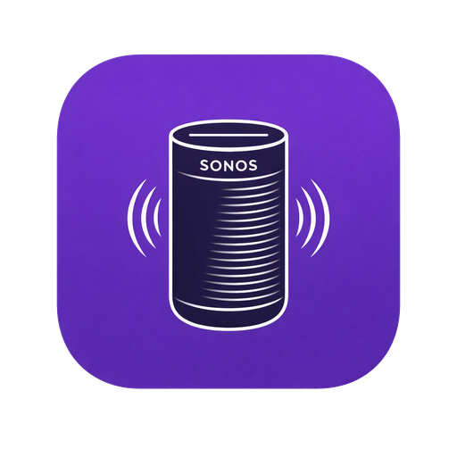

<p align="center">
  
</p>

<h1 align="center">homebridge-sonos-scenes</h1>

<p align="center">Build Sonos scenes in Homebridge and trigger them from Apple Home.</p>

> [!IMPORTANT]
> This plugin is in active early testing. The local-first scene workflow is usable today, but some Sonos edge cases are still being hardened and cloud-backed playback is still future work. If you try it, please share bugs, setup notes, and UI feedback in [GitHub Issues](https://github.com/applemanj/homebridge-sonos-scenes/issues).

`homebridge-sonos-scenes` lets you create repeatable Sonos scenes such as:

- group specific rooms together
- start a favorite or line-in source
- set lead-room and per-room volume
- optionally ungroup the rooms when the scene turns off

It also supports Sonos Amp `virtual rooms` for split-room installs where the left and right speaker channels belong to different spaces.

This plugin is meant for scene-style Sonos workflows, not full everyday Sonos control.

## What You Get

Each saved scene creates:

- a HomeKit switch to run the scene
- a companion HomeKit volume control accessory for that scene

Each saved virtual room creates:

- a HomeKit lightbulb accessory for one Sonos Amp channel
- `On` control for channel mute and unmute
- `Brightness` control for that virtual room's volume target

Typical examples:

- "Office Bedtime" groups a few rooms, starts white noise, and sets quiet volumes
- "Whole House Line In" groups several rooms around a line-in source
- "Morning Music" starts a favorite and sets different room volumes

## What Works Today

- Live Sonos discovery from the Homebridge UI
- Friendly scene editor for picking rooms and sources
- Favorites that are playable over the local Sonos path
- Line-in scenes
- Grouping and ungrouping
- Background scene switch reconciliation for external Sonos grouping changes
- Scene test runs before saving
- Per-room volume overrides
- Virtual rooms for Sonos Amp left and right split-room installs
- Per-channel on/off plus virtual room volume control
- Virtual room create, edit, and validation flows in the Homebridge UI

## Current Limits

- This is still beta software
- Some complex Sonos favorites do not work reliably over the local-only path
- `TV` remains an experimental local option; enable `Show TV input sources` before testing it
- Scene switch reconciliation currently tracks group membership, not exact source or volume state
- `Local + Cloud` is reserved for future self-hosted broker support and is not wired into playback yet
- Virtual rooms on the same Amp still share one Sonos playback source
- External master-volume changes can still affect the perceived loudness of both virtual rooms

For most people, `Local Only` is the right mode today.

## Roadmap

This roadmap is meant to show the direction of the project, not lock every feature to a specific release date. The theme is deliberate: make the local-only beta dependable first, then add cloud-backed capabilities where they solve real Sonos limitations. Priorities may shift based on real-world testing, Sonos behavior, and community feedback.

### Near-Term Hardening (v0.2.x): Finish the Beta

- **TV Source General Availability**: move local TV input scenes out of the advanced/experimental toggle after broader validation across TV-capable Sonos devices and common home-theater setups.
- **Scene State Reconciliation**: expand the v0.1.31 group-membership reconciliation into a stronger live-state system, including source and playback-state awareness where Sonos reports those states reliably.
- **Volume Ramping / Fade-In-Fade-Out**: let scenes move volume gradually instead of jumping instantly, making bedtime, gentle wake, and ambience scenes feel more natural.
- **Scene Off = Restore Previous State**: add off behaviors beyond ungrouping, such as pause, stop, restore the prior group topology, or return rooms to a default idle state.
- **Crossfade, Sleep Timer, and EQ Per Scene**: add optional per-scene playback settings such as crossfade, sleep timer minutes, bass, treble, and loudness, with safeguards so scenes do not leave speakers in surprising states.

### Mid-Term Expansion (v0.3.x): Cloud Broker & Smarter Workflows

- **Complete the Self-Hosted Cloud Broker**: finish OAuth, token refresh, and cloud-backed favorites or playlist loading through the `/broker` scaffold, with a focus on sources that local control cannot play reliably.
- **Scene Chaining / Sequences**: allow one scene to trigger another after a delay. For example, "Dinner Party" could start with jazz at conversation volume, then switch to a louder "Party" scene later.
- **Conditional Logic / Smart Scenes**: add lightweight rules such as quiet volumes after 10 PM, skipping a room that is already playing, or avoiding music scenes while TV audio is active.
- **Portable Speaker Awareness**: detect portable-speaker availability and battery status where possible, so scenes can skip Move or Roam speakers that are offline, Bluetooth-connected, or low on battery.
- **Import / Export and Scene Templates**: support JSON import/export for portability and add starter templates such as "Whole House Party" or "Bedtime Wind-Down."

### Differentiating Polish (v0.4.x+): Why This Plugin

- **Activity History & Scene Analytics**: show recent scene runs, trigger source, success or failure, and useful debugging details in the Homebridge UI.
- **Clone Scene & Batch Edit**: make it easier to duplicate a scene, tweak it, or update shared settings across several scenes at once.
- **Dynamic Favorite Health Checks**: periodically validate that saved favorites still exist and are playable, then warn in the UI before a user clicks `Run Test`.
- **AirPlay Receiver Prep Scenes**: configure rooms as ready-to-use AirPlay targets without starting playback, so users can hand off from an iPhone or Mac after the scene prepares grouping and volume.
- **Per-Accessory Room Assignment**: let users choose where companion HomeKit accessories, such as scene volume controls, should appear in Apple Home.

### Ecosystem & Community

- **Migration Assistant from homebridge-zp**: provide a best-effort helper that translates common `homebridge-zp` zones, favorites, or grouping patterns into starting-point scenes.
- **Mobile-First UI Pass**: improve the custom UI for phone-sized Homebridge screens, especially the scene editor and virtual-room workspace.
- **Better Error Recovery & Partial Success**: make scene execution more resilient when one room fails, with clearer logging, safer continuation where possible, and optional rollback or cleanup for half-applied scenes.

## Install

Install from the Homebridge UI by searching for `homebridge-sonos-scenes`, or from npm:

```bash
npm i homebridge-sonos-scenes
```

Then restart Homebridge.

## First-Time Setup

1. Open the plugin settings in Homebridge.
2. Click `Discover` to load your Sonos households, rooms, favorites, and inputs.
3. Click `New Scene`.
4. Name the scene.
5. Pick the rooms you want in `Scene Rooms`.
6. Choose a source such as `favorite` or `line in`.
7. Optionally set room volume values.
8. Click `Validate` to check the scene without changing playback.
9. Click `Run Test` to try it on your Sonos system.
10. Click `Save Scene Changes`.
11. Use Homebridge's footer `Save` button to write the full plugin config to disk.

After Homebridge reloads the config, the scene accessories should appear in Apple Home.

## Virtual Room Setup

Use virtual rooms when one Sonos Amp feeds two spaces, such as a bedroom speaker on the left channel and a bathroom speaker on the right channel.

1. Open the plugin settings in Homebridge.
2. Click `Discover` so the UI has a current Sonos topology.
3. Open `Virtual Room Workspace`.
4. Click `New Virtual Room`.
5. Choose the household and Amp player.
6. Name the left and right channel rooms.
7. Set the default volume, max volume, and on/off behaviors.
8. Click `Validate Virtual Room`.
9. Click `Save Virtual Room Changes`.
10. Use Homebridge's footer `Save` button to write the full plugin config to disk.

After Homebridge reloads, each virtual room appears in Apple Home as a lightbulb-style accessory. `On` controls whether that channel is active, and `Brightness` adjusts the virtual room volume target. Both sides of the Amp still share the same Sonos source.

## Recommended Starting Point

If you are new to the plugin, start with:

- `Execution Mode`: `Local Only`
- a small scene with one or two rooms
- a known-good `favorite` or `line in` source

That gives you the smoothest first test.

## Troubleshooting

If a scene does not work the first time:

- run `Discover` again so the editor has a fresh Sonos snapshot
- use `Validate` before `Run Test`
- try a simpler local favorite or a line-in scene first
- check the Homebridge log for the scene run details
- restart Homebridge after updating the plugin

If Apple Home still shows stale or unsupported accessories after an update, close and reopen the Home app first.

## Feedback

Real-world feedback is especially helpful right now. Useful bug reports include:

- your Sonos speaker models
- whether the scene uses `favorite`, `line in`, or `tv`
- what happened when you clicked `Run Test`
- the relevant Homebridge log output

Open issues here:

- [GitHub Issues](https://github.com/applemanj/homebridge-sonos-scenes/issues)

## Advanced Docs

If you want the more technical details, use these docs:

- [Architecture and Developer Notes](docs/architecture.md)
- [Virtual Rooms](docs/virtual-rooms.md)
- [Cloud Broker Contract](docs/cloud-broker.md)
- [Self-Hosted Broker Scaffold](broker/README.md)
- [Example Config](examples/config.example.json)
